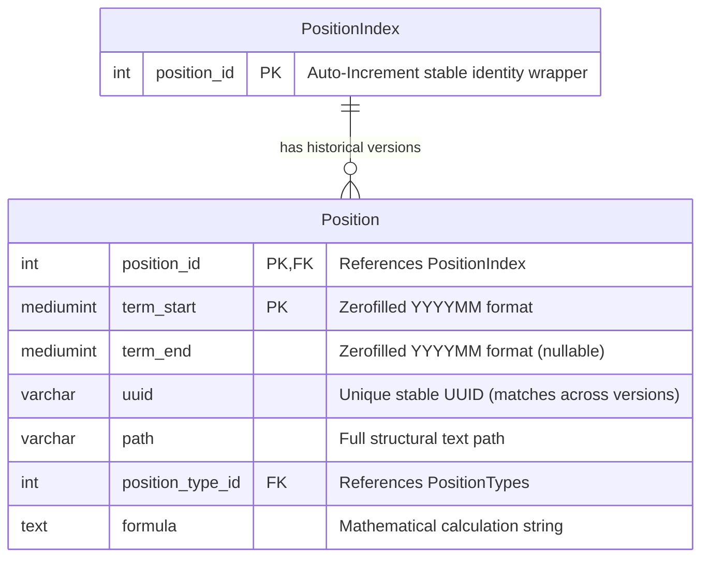
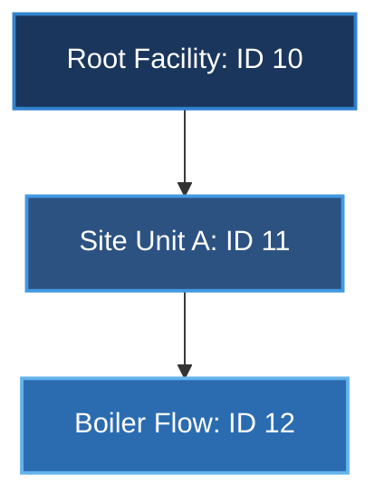
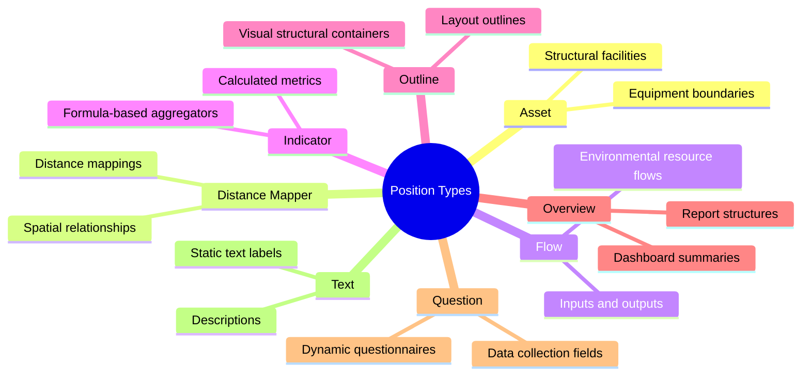
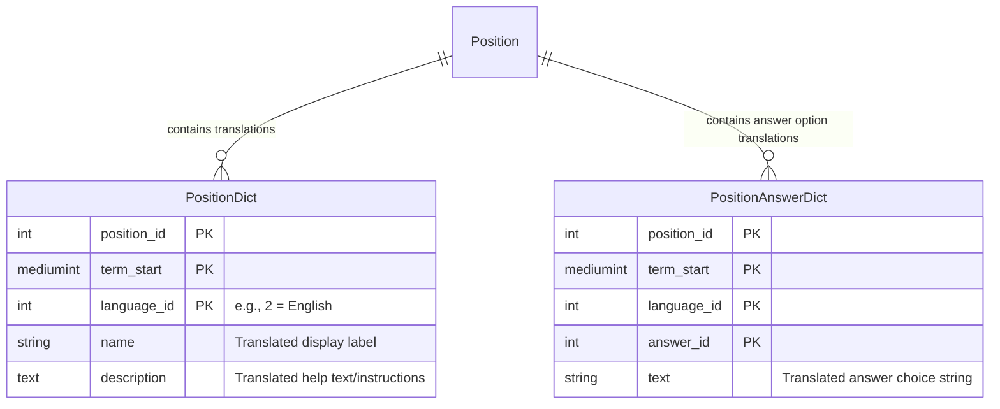

# Sofi Architecture Study: The "Position" Domain Subsystem

This document provides a comprehensive technical breakdown of the **Position** concept within the SoFi TS codebase. The "Position" is the foundational building block of the platform's environmental data model, structural hierarchy, questionnaire framework, and calculation engine.

---

## 1. Core Concept of "Position"

In SoFi, a **Position** is a versioned, multi-typed hierarchical node in an environmental data tree. It serves as a unified structural unit that can represent:
*   **Structural Nodes**: Facilities, organizational units, or site boundaries.
*   **Data Collection Fields**: Direct question inputs, forms, and variables.
*   **Environmental Flows**: Flows of energy, materials, raw resources, or emissions.
*   **Logical Calculators**: Mathematical indicators that process variables using defined formulas.

Instead of separating these concepts into distinct, disconnected domain entities, the platform maps them onto a single, cohesive polymorphic tree structure unified under the `Position` entity. This allows dynamic layout rendering, inheritance of attributes, and unified data aggregations.

---

## 2. Temporal Versioning Architecture

Environmental reporting and organization hierarchies change over time. Facility footprints expand, calculation formulas evolve, and data collection structures are updated annually. To preserve historical integrity, SoFi implements a **Temporal Versioning Model** instead of static relational keys.



### The Stable Identity Wrapper Pattern
If every position has multiple historical revisions (valid between different times), referencing positions directly using a versioned key would cause severe foreign key cascade problems. If a position's attributes are updated for a new fiscal term, every linked transaction, questionnaire, and rule would have to update its target keys.

To solve this, SoFi uses the **Stable Identity Wrapper Pattern**:
1.  **`PositionIndex`**: A lightweight wrapper table containing exactly one auto-incrementing column: `position_id` (integer).
2.  **`Position`**: The concrete versioned entity. It utilizes a **composite primary key** consisting of `(position_id, term_start)`.
    *   `position_id` maps back to the stable ID in `PositionIndex`.
    *   `term_start` is a `mediumint(6)` (stored in a zerofilled `YYYYMM` format, e.g., `202601` for January 2026) indicating when this version became active.

> [!NOTE]
> All external entities that require a stable reference to a position over time link to `PositionIndex.position_id` rather than the temporal composite key. Inside version-sensitive calculation cycles, the system resolves the stable ID to the appropriate version of the `Position` entity using the corresponding reporting period.

---

## 3. Hierarchical Management (The Closure Table Pattern)

Positions are organized in a recursive parent-child tree (e.g., *Site -> Production Line -> Machine -> Input Flow -> Questionnaire Question*). Navigating recursive structures in SQL using standard self-referencing joins (`parent_id`) is highly inefficient, requiring complex recursive CTE queries or $O(N)$ database roundtrips.

SoFi implements a **Transitive Closure Table** pattern using the `PositionPath` entity.

### How the Closure Table Works
*   The `Position` entity maintains a standard self-referencing relationship to its immediate parent: `(parent_position_id, parent_term_start)`.
*   The `PositionPath` entity serves as a map that records **every path** from every ancestor to every descendant in the tree at any given depth.



#### Corresponding `PositionPath` Representation:
| Ancestor ID | Ancestor Term Start | Descendant ID | Descendant Term Start | Depth | Description |
| :--- | :--- | :--- | :--- | :--- | :--- |
| **10** | 202601 | **10** | 202601 | **0** | Self-reference (Root) |
| **10** | 202601 | **11** | 202601 | **1** | Root -> Site Unit A |
| **10** | 202601 | **12** | 202601 | **2** | Root -> Boiler Flow (transitive) |
| **11** | 202601 | **11** | 202601 | **0** | Self-reference (Site Unit A) |
| **11** | 202601 | **12** | 202601 | **1** | Site Unit A -> Boiler Flow |
| **12** | 202601 | **12** | 202601 | **0** | Self-reference (Boiler Flow) |

### Operational Benefits
1.  **Retrieve Entire Sub-Tree**: To load the entire sub-tree under `Root (ID 10)`, query `PositionPath` where `ancestor_position_id = 10` in a single query.
2.  **Retrieve Upward Lineage**: To load the breadcrumbs/parentage of `Boiler Flow (ID 12)`, query `PositionPath` where `descendant_position_id = 12` ordered by depth.
3.  **Depth Filtering**: Easily fetch only immediate children by adding `depth = 1`.

---

## 4. Entity Schema Definition

The structural attributes of `Position` cover version tracking, layout sorting, formula definitions for indicators, and data entry validation.

### Core Database Fields in `position`

| Field | Type | Description |
| :--- | :--- | :--- |
| **`position_id`** *(PK)* | `int(11) unsigned` | Stable ID pointing to `position_index`. |
| **`term_start`** *(PK)* | `mediumint(6) zerofill` | The start period of this revision in `YYYYMM` format. |
| **`uuid`** | `varchar(36)` | Unique ID preserved across version updates. |
| **`term_end`** | `mediumint(6) zerofill` | Active end period `YYYYMM` (nullable if current). |
| **`parent_position_id`** | `int(11) unsigned` | Parent identifier (nullable for root nodes). |
| **`parent_term_start`** | `mediumint(6) zerofill` | Parent term start reference. |
| **`path`** | `varchar(255)` | Materialized text path (e.g. `/10/11/12`) for quick breadcrumb reads. |
| **`position_type`** | `tinyint(3) unsigned` | Enum mapping to the 8 core taxonomy types. |
| **`position_subtype_id`** | `int(11) unsigned` | Subtype mapping for customized templates. |
| **`sort`** | `mediumint(9)` | Display sort weight in layouts and trees. |
| **`formula`** | `text` | Mathematical formula string used exclusively by `Indicator` type positions. |
| **`requires_comment`** | `tinyint(1)` | If true, user must provide a comment when inputting a value. |
| **`tolerance`** | `int(10) unsigned` | Acceptable input variance percentages for outlier detection. |
| **`answer_type`** | `tinyint(3)` | Enum representing input types (e.g., Numeric, Boolean, Option List). |
| **`answer_text`** | `tinyint(1)` | If true, enables free-form text remarks for answers. |
| **`unit_class_id`** | `int(11) unsigned` | Restricts inputs to a unit category (e.g., Mass, Energy, Volume). |

---

## 5. Domain Taxonomy: The 8 Position Types

The logic of a position changes drastically based on its type. There are **8 Core Position Types** defined in the system metadata:



### 1. Asset
*   **Role**: Represents physical or conceptual structural assets (e.g., factories, office buildings, manufacturing lines, fleet divisions).
*   **Usage**: Acts as primary nodes in the site hierarchy tree. Other positions (like Flows or Questions) sit underneath Asset nodes.

### 2. Distance Mapper
*   **Role**: Tracks spatial relationships, physical coordinate offsets, or logistics matrices.
*   **Usage**: Utilized in scope-3 emission tracking (e.g. employee commuting or logistics supply chains) to calculate transport metrics.

### 3. Flow
*   **Role**: Tracks physical mass or energy flows (inputs/outputs).
*   **Usage**: EHS reporting (e.g., *Natural Gas Input*, *Hazardous Waste Output*, *Electricity Consumed*). Tied to unit classes like Mass (kg, tons) or Energy (kWh, MJ).

### 4. Indicator
*   **Role**: Calculated metric nodes.
*   **Usage**: Contains a mathematical string in the `formula` column. The formula references other positions (variables) by their `position_id` (via the `position_variable` mapping table) to calculate high-level sustainability values like Carbon Footprint ($CO_2e$) or Energy Intensity.

### 5. Outline
*   **Role**: Layout outlines or structural containers.
*   **Usage**: Used to format the structure of data collection forms, grouping related sub-sections.

### 6. Overview
*   **Role**: High-level visual summaries or dashboard widgets.
*   **Usage**: Used to define specific report structures or high-level status rollups.

### 7. Question
*   **Role**: Active data-collection questions.
*   **Usage**: Acts as the primary user input fields within dynamic forms. Tied to `answer_type` (e.g., dropdown option selections, dates, checkboxes).

### 8. Text
*   **Role**: Explanatory layout markers.
*   **Usage**: Visual-only elements used to show instructions, regulatory definitions, or formatting subtitles in data input workflows.

---

## 6. Multilingual Translation Design

To avoid duplicating columns and database tables for localized fields (e.g., having `name_en`, `name_de`, `name_fr`), SoFi abstracts all textual attributes into localized dictionary tables:



### Benefits of the Translation Scheme
*   **Seamless Localization**: Adding support for a new language requires zero database schema modifications; only new records are inserted into `position_dict` and `position_answer_dict`.
*   **Historic Text Alignment**: Because dictionaries include `term_start`, text labels can be modified historically. For instance, the name of a site can be changed in 2026 while retaining its original name in historical 2020 reporting blocks.

---

## 7. Dynamic Questionnaire Subsystem

Positions are heavily utilized inside SoFi's dynamic web forms via several mapping tables:

### QuestionnairePosition (`questionnaire_position`)
Maps versioned positions into active data-entry questionnaires:
*   Combines `questionnaire_id`, `term_start`, `position_id`, and `period` (the month or quarter of reporting).
*   Enables setting custom `default_unit_id` values on a per-questionnaire basis. For instance, the same energy flow position can be reported in `kWh` in a European questionnaire and in `MWh` in an Asian questionnaire.

### Conditional Visibility Engine (`questionnaire_template_position_condition`)
Enables dynamic form behavior. If a question is only relevant based on a prior answer, a condition is set:
*   **`source_position`**: The question being evaluated.
*   **`source_answer_id`**: The answer value that triggers the rule.
*   **`target_position`**: The question that will be shown or hidden based on the condition.

### User Assignment Mapping (`user_questionnaire_position`)
Tracks data collection responsibilities down to a highly granular level:
*   Maps exactly which `Position` in a `Questionnaire` is assigned to a specific `User`.
*   Utilizes a JSON column to store the specific `periods` (e.g. specific months or quarters) the user is assigned, restricting access to data entry fields.

---

## 8. Database Evidence & Live Samples

To validate the theoretical architecture of the SoFi TS Position domain, this section presents raw sample data queried directly from the active `sofi` database running in the local Docker environment.

### 8.1 Live Polymorphic Position Types
The database defines the 8 types under `sofi.position_types`. Below are three real-world position samples retrieved for each active type:

| Position ID | Type Name | Localized Name (English) | Formula / Attribute Detail |
| :--- | :--- | :--- | :--- |
| **33** | **Outline** | Base Data | Structural questionnaire grouping node. |
| **34** | **Outline** | Production Data | Structural questionnaire grouping node. |
| **39** | **Outline** | Questions | Visual container. |
| **18** | **Overview** | SIL Overview | Summary calculation dashboard. |
| **24** | **Overview** | SIL Testing | Summary aggregation block. |
| **29** | **Overview** | Total Area | Area aggregation node. |
| **126** | **Text** | CIText1 | Static regulatory/help instruction text. |
| **166** | **Text** | CPTextPos | Informational text block. |
| **273** | **Text** | CopyValuesText | Historical text instruction. |
| **16** | **Question** | Multiple choice question | User form input. |
| **40** | **Question** | Text question | User free-text input. |
| **41** | **Question** | Single choice question (weighted) | Weighted numeric evaluation input. |
| **7** | **Flow** | Standard Grid | Mass/Energy input flow (Electricity). |
| **8** | **Flow** | Coal | Energy resource flow (Solid Fuel). |
| **9** | **Flow** | Natural Gas | Energy resource flow (Gaseous Fuel). |
| **22** | **Indicator** | SIL Indicator (=OV+F1+F2) | Formula: `$var18+$var19+$var20` |
| **23** | **Indicator** | SIL Indicator 2 (=Indicator 1) | Formula: `$var22` |
| **44** | **Indicator** | Electricity / Employee (first calc) | Formula: `$var36/$var30` |
| **1** | **Asset** | Factory Area | Site/asset physical footprint boundary. |
| **2** | **Asset** | Office Area | Site/asset office footprint boundary. |
| **3** | **Asset** | Full-Time Female | HR/social metric asset category. |
| **1486** | **Distance Mapper** | FDC root position | Travel logistics base mapping node. |
| **1487** | **Distance Mapper** | Domestic haul | Scope 3 commuting distance tracker. |
| **1488** | **Distance Mapper** | First class: domestic | Scope 3 flight distance category tracker. |

---

### 8.2 Temporal Versioning in Action
To prove the **Stable Identity Wrapper Pattern**, we can trace positions `101` and `105`. Both have static identity IDs but morph over time through multiple rows matching different `term_start` and `term_end` timestamps.

#### Case Study 1: `position_id = 101` (Asset revision)
*   **Version 1 (Initial)**: Valid from inception (`000000`) until December 2011 (`201112`).
    *   **Name**: *Asset1*
*   **Version 2 (Revision)**: Valid from January 2012 (`201201`) to indefinite future (`NULL`).
    *   **Name**: *Asset1 from 01/2012* (showing a historical name modification).

#### Case Study 2: `position_id = 105` (Flow revision cycle)
This flow position has undergone six consecutive annual fiscal cycles. Each cycle has its own term record:

| Position ID | Term Start | Term End | Active Parent ID | Localized Name |
| :--- | :--- | :--- | :--- | :--- |
| **105** | `000000` | `200812` | 104 | Flow_Start |
| **105** | `200901` | `200912` | 104 | Flow_2009 |
| **105** | `201001` | `201012` | 104 | Flow_2010 |
| **105** | `201101` | `201112` | 104 | Flow_2011 |
| **105** | `201201` | `201212` | 104 | Flow_2012 |
| **105** | `201301` | `NULL` (Current) | 104 | Flow_2013 |

> [!TIP]
> Notice how `parent_position_id = 104` remains stable across all 6 temporal rows. This demonstrates how parentage links to the `PositionIndex` rather than a specific version, keeping tree structural identity fully intact when versions change.

---

### 8.3 Live Transitive Closure Table (`position_path`) Trace
We queried the database for the hierarchical ancestors of **"SIL Green Electricity" (ID 67)**. The closure table `sofi.position_path` mapped its lineage effortlessly:

```sql
SELECT pp.ancestor_position_id, pd.name, pp.depth 
FROM sofi.position_path pp 
JOIN sofi.position_dict pd ON pp.ancestor_position_id = pd.position_id AND pp.ancestor_term_start = pd.term_start 
WHERE pp.descendant_position_id = 67 AND pd.language_id = 2 
ORDER BY pp.depth;
```

#### Query Output Result:
| Ancestor ID | Ancestor Name | Hierarchy Depth | Role in Path |
| :--- | :--- | :--- | :--- |
| **67** | **SIL Green Electricity** | **0** | Self-reference node |
| **66** | **SIL Total Electricity** | **1** | Immediate Parent |
| **65** | **SIL Total Energy** | **2** | Grandparent |
| **24** | **SIL Testing** | **3** | Great-Grandparent (Root Node) |

Instead of querying recursive nested joins, the application loads this full path instantly with a single non-recursive query, highlighting the immense scaling benefits of the closure table structure.

---

### 8.4 Questionnaire Visibility Rule Trigger Sample
To prove the conditional visibility framework, we fetched a real-world condition trigger mapping:

*   **Rule Scope**: Questionnaire ID `918`
*   **Source Trigger Question**: `CPMultipleChoiceQuestion` (ID **158**, term `000000`)
*   **Trigger Answer ID**: **36** (translated as Option **"A"** in English)
*   **Target Affected Node**: `Factory Area` (ID **1**, term `000000`)

When a user opens questionnaire `918` and selects option **"A"** on question **158**, the rendering engine automatically parses `questionnaire_template_position_condition` to reveal/enable the asset input fields for `Factory Area` (ID 1).

