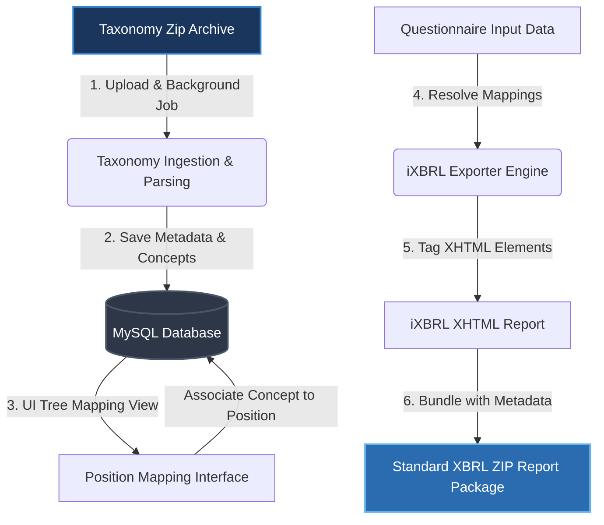
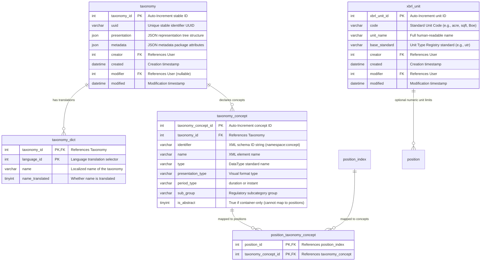
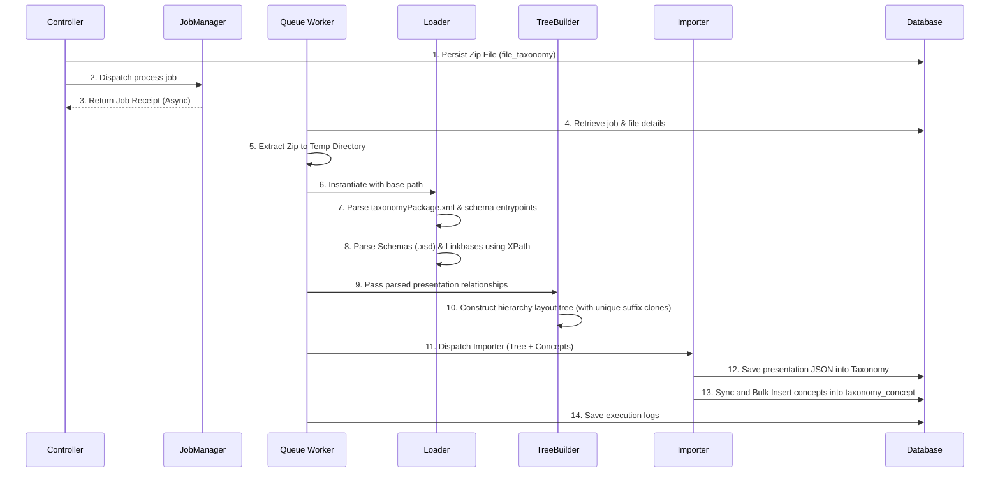
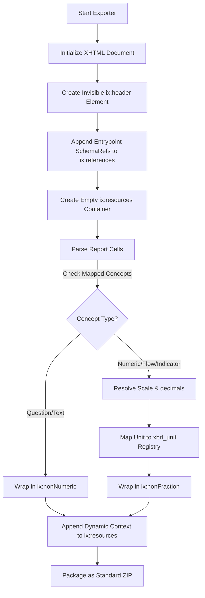

# SoFi Architecture Study: The "XBRL Questionnaire" (Disclosure Management) Subsystem

This document provides a comprehensive technical breakdown of the **XBRL Questionnaire** and **Disclosure Management** subsystem within the SoFi TS codebase. This subsystem enables organizational users to ingest standard, industry-recognized ESG taxonomies (such as European Sustainability Reporting Standards - ESRS, and Global Reporting Initiative - GRI), map questionnaire data collection inputs to specific XBRL taxonomy concepts, and compile compliance data into fully validated, standard-conforming Inline XBRL (iXBRL) digital report packages.

---

## 1. Core Subsystem Architecture

The **Disclosure Management Subsystem** bridges the gap between internal environmental tracking systems and external regulatory reporting requirements. Instead of forcing users to manually transpose database records into complex regulatory portals, SoFi allows them to map their existing questionnaires directly to regulatory schemas.



### The Six-Step Workflow Lifecycle:
1. **Ingestion**: An administrator uploads an XBRL Taxonomy Package (a zipped folder containing XML schemas, presentation/label linkbases, and package metadata). A background queue worker parses the contents.
2. **Schema & Tree Generation**: The hierarchy tree of presentation elements is stored as a JSON hierarchy in the database, while individual taxonomy concepts are extracted into structural rows.
3. **Position Mapping**: In the Position administration panel, data fields (Positions of type `Question`, `Flow`, or `Indicator`) are linked to their corresponding concrete taxonomy concepts via a many-to-many join table.
4. **Data Collection**: Users fill out their standard SoFi questionnaires at various sites/facilities across reporting periods.
5. **iXBRL Document Generation**: During export, an exporter parses the template and dynamically wraps collected data inputs in XHTML with standard XML tagging (e.g. `<ix:nonFraction>` or `<ix:nonNumeric>` tags).
6. **Package Assembly**: The XHTML output is zipped with a standard `META-INF/reportPackage.json` metadata block, producing a certified iXBRL report package ready for regulatory submission.

---

## 2. Database Schema & Relational Design

The subsystem uses five primary tables to store taxonomy packages, localized dictionary strings, concrete concept schemas, unit definition mappings, and parent-child questionnaire-to-concept maps.



### 2.1 Table Schemas & Attributes

#### 1. Taxonomy (`taxonomy`)
Stores imported taxonomy definitions. Rather than representing complex XML presentation linkbases in high-join relational tables, SoFi parses the parent-child node relationships into a fast-loading hierarchical JSON array inside the `presentation` column.

| Column | Type | Nullable | Key | Default | Description |
| :--- | :--- | :--- | :--- | :--- | :--- |
| **`taxonomy_id`** | `int unsigned` | NO | PK | *Auto-Increment* | Unique stable ID for the taxonomy. |
| **`uuid`** | `varchar(36)` | YES | UNI | `NULL` | Preserved stable identity across uploads. |
| **`presentation`** | `json` | YES | | `NULL` | JSON structure representing the visual hierarchy in tree views. |
| **`metadata`** | `json` | YES | | `NULL` | Extracted package attributes (publisher, date, entry points). |
| **`creator`** | `int unsigned` | NO | MUL | | User ID who uploaded the taxonomy. |
| **`created`** | `datetime` | NO | | | Creation date. |
| **`modifier`** | `int unsigned` | YES | MUL | `NULL` | User ID who updated the taxonomy (if any). |
| **`modified`** | `datetime` | YES | | `NULL` | Modification date. |

#### 2. Taxonomy Localizations (`taxonomy_dict`)
Provides translation keys for the taxonomies.

| Column | Type | Nullable | Key | Default | Description |
| :--- | :--- | :--- | :--- | :--- | :--- |
| **`taxonomy_id`** | `int unsigned` | NO | PK, FK | | References `taxonomy.taxonomy_id`. |
| **`language_id`** | `int unsigned` | NO | PK | | System language ID (e.g. `2` for English). |
| **`name`** | `varchar(255)` | NO | | | Localized name of this taxonomy package. |
| **`name_translated`** | `tinyint unsigned` | NO | | `0` | Flag indicating translation status. |

#### 3. Taxonomy Concept (`taxonomy_concept`)
Represents concrete data elements declared in the XML schemas. These elements are the specific questions, metrics, or indicators mandated by environmental frameworks.

| Column | Type | Nullable | Key | Default | Description |
| :--- | :--- | :--- | :--- | :--- | :--- |
| **`taxonomy_concept_id`** | `int unsigned` | NO | PK | *Auto-Increment* | Stable concept ID. |
| **`taxonomy_id`** | `int unsigned` | NO | FK, MUL | | References `taxonomy.taxonomy_id`. |
| **`identifier`** | `varchar(400)` | NO | MUL | | XML Schema ID string (e.g. `esrs_TargetCoverage`). |
| **`name`** | `varchar(400)` | YES | | `NULL` | Element tag name. |
| **`type`** | `varchar(255)` | YES | | `NULL` | Data type constraint (e.g. `decimalItemType`, `stringItemType`). |
| **`presentation_type`** | `varchar(64)` | YES | | `NULL` | Rendered layout element type (e.g., textbox, choice). |
| **`period_type`** | `varchar(255)` | YES | | `NULL` | Temporal attribute: `duration` (over a period) or `instant` (a timestamp). |
| **`sub_group`** | `varchar(255)` | YES | | `NULL` | Sub-group categorizer (regulatory disclosure context). |
| **`is_abstract`** | `tinyint unsigned` | NO | | `0` | If `1`, it is a structural layout group node that cannot store actual data. |

#### 4. Position Mappings (`position_taxonomy_concept`)
Maintains the associations between internal SoFi Questionnaire positions and external regulatory concepts.

| Column | Type | Nullable | Key | Default | Description |
| :--- | :--- | :--- | :--- | :--- | :--- |
| **`position_id`** | `int unsigned` | NO | PK, FK | | References `position_index.position_id`. |
| **`taxonomy_concept_id`** | `int unsigned` | NO | PK, FK | | References `taxonomy_concept.taxonomy_concept_id`. |

#### 5. XBRL Unit definitions (`xbrl_unit`)
Maintains standardized units recognized in XBRL reporting frameworks.

| Column | Type | Nullable | Key | Default | Description |
| :--- | :--- | :--- | :--- | :--- | :--- |
| **`xbrl_unit_id`** | `int unsigned` | NO | PK | *Auto-Increment* | Stable unit definition wrapper. |
| **`code`** | `varchar(50)` | YES | UNI | `NULL` | Standardized unit code (e.g., `acre`, `sqft`, `Boe`). |
| **`unit_name`** | `varchar(100)` | YES | | `NULL` | Readable unit name (e.g. "Barrel of Oil Equivalent"). |
| **`base_standard`** | `varchar(100)` | YES | | `NULL` | Base registry standard (e.g., `utr` for Unit Type Registry). |
| **`creator`** | `int unsigned` | NO | FK, MUL | | References `User`. |
| **`created`** | `datetime` | NO | | | Creation timestamp. |
| **`modifier`** | `int unsigned` | NO | FK, MUL | | References `User`. |
| **`modified`** | `datetime` | NO | | | Last modification timestamp. |

---

## 3. The Taxonomy Ingestion Lifecycle

Importing an XBRL taxonomy is a heavy, multi-phase operational process handled asynchronously to ensure large schemas do not exhaust browser or script runtimes.



### 3.1 Background Processing Worker (`App\SoFi\Job\Worker\Taxonomy\Process`)
When a taxonomy zip is submitted, `SoFi\Taxonomy\Controller` saves the file references and dispatches the background task:
*   Extracts the zip archive to a randomized temporary path.
*   Instantiates the `App\SoFi\Taxonomy\Processor\Loader` to locate entry points.
*   Invokes metadata readers to update the taxonomy's relational profile.
*   Triggers the `Importer` to sync trees and database nodes within a single database transaction.

### 3.2 Parsing the Schemas & Linkbases (`App\SoFi\Taxonomy\Processor\Loader`)
The `Loader` parses standard XBRL structures:
1. **Package Discovery**: Looks for `taxonomyPackage.xml` to fetch metadata properties (author, description, license) and schemas.
2. **XPath Parsing**: Uses `DOMXPath` to parse XML Schema (`.xsd`) schemas and Linkbase (`.xml`) documents.
3. **Concept Extraction**: Finds structural XML elements (`<xsd:element id="...">`) and parses them into model objects.
4. **Label Mapping**: Reads label linkbases (`<link:labelLink>`) to map concept IDs to localized text (e.g. mapping `esrs_TargetCoverage` to its English title label).
5. **Presentation Linkbase Processing**: Evaluates presentation links (`<link:presentationLink>`) and presentation arcs (`<link:presentationArc>`) mapping structural hierarchies:
   * **Role definitions** (`<link:roleType>`) are mapped to represent visual categories or outline forms.
   * **Arcs** mapping parents, descendants, and visual sort order are constructed into logical relation trees.

### 3.3 Visual Layout Trees (`App\SoFi\Taxonomy\Processor\TreeBuilder`)
XBRL concept nodes are often polymorphic: a single concept might be presented in multiple layout categories. To prevent tree rendering conflicts due to duplicate keys, `TreeBuilder` implements a recursive suffix cloning pattern:
*   It tracks node relationships in a `childrenMap`.
*   During tree navigation, if a node is traversed under a different parent, `TreeBuilder` generates a unique string key suffix using an internal `cloneCounter` (e.g. renaming duplicate keys to `concept_id_1`, `concept_id_2`).
*   This builds a visually continuous, non-conflicting presentation layout tree saved as JSON inside `taxonomy.presentation`.

---

## 4. Position-to-Concept Mapping

 Questionnaire positions are associated with taxonomy concepts via `position_taxonomy_concept`. In SoFi, this mapping enables two modes of operations:
*   **Numeric/Flow Mapping**: Connects environmental flow volumes (e.g. Natural Gas consumed, grid electricity, carbon emissions) to concrete metric concepts.
*   **Questionnaire/Field Mapping**: Connects specific textual questions or dropdown selections inside a dynamic compliance questionnaire to their exact disclosure targets.

### 4.1 Strict Configuration Constraints
To ensure validity in final reports, mappings are verified at the template configuration stage by the constraint engine:

#### `App\SoFi\DisclosureTemplate\Content\Constraint\XbrlConceptConstraint`
This validator inspects mapped concepts before saving. It enforces standard XML namespaces:
```php
public function check(mixed $data, string $key = ''): void
{
    $concept = explode(':', $data ?? '');
    if (2 !== count($concept)) {
        $this->errors[] = $this->getDictionary()->trans(
            'validation_error_invalid_xbrl_concept',
            [self::TRANS_PATH => $this->formattedPath()],
            self::DOMAIN
        );

        return;
    }

    parent::check($data, $key);
}
```
> [!IMPORTANT]
> The validator verifies that every mapped concept uses the strict standard format `namespace:identifier` (e.g. `esrs:GreenhouseGasesCoveredByEmissionReductionTarget`).

---

## 5. The iXBRL Export Engine

The generation of Inline XBRL (iXBRL) is handled by the specialized XHTML exporter `App\SoFi\Export\Report\Exporter\InlineXbrl`.



### 5.1 Document Initialization & Header Block
When starting, `InlineXbrl` initializes a clean XHTML container and prepends an invisible context block:
```xml
<div style="display: none;">
  <ix:header>
    <ix:references xml:lang="en">
      <link:schemaRef xlink:href="http://xbrl.efrag.org/taxonomy/draft-esrs/2024/esrs-all.xsd" xlink:type="simple" />
    </ix:references>
    <ix:resources>
       <!-- Dynamic Contexts & Units Appended Here -->
    </ix:resources>
  </ix:header>
</div>
```

### 5.2 Dynamic Reporting Contexts
Environmental metrics are highly dimensioned (relying on reporting site, organization boundaries, tag categorizations, and temporal periods). Rather than hardcoding a static context, the system generates contexts dynamically in `appendContextToResources()` using `ContextParamBuilder`:
*   Context IDs follow a strict format: `context-{disclosure_id}-{site|tag}-{siteId|tagId}-{startTerm}-{endTerm}`.
*   If a concept represents a snapshot value, the period tag is flagged as `instant` and generated as `<xbrli:instant>` rather than a `<xbrli:startDate>`/`<xbrli:endDate>` range.
*   Generated contexts are appended to `<ix:resources>`:
```xml
<xbrli:context id="context-12-site-4-202601-202612">
  <xbrli:entity>
    <xbrli:identifier scheme="http://standards.iso.org/iso/17442">549300OUH0VVE75CBF85</xbrli:identifier>
  </xbrli:entity>
  <xbrli:period>
    <xbrli:startDate>2026-01-01</xbrli:startDate>
    <xbrli:endDate>2026-12-31</xbrli:endDate>
  </xbrli:period>
</xbrli:context>
```

### 5.3 Dynamic Tagging Rules
During table cell compilation, SoFi's XHTML grid exporter checks if the cell's underlying questionnaire position is mapped to an XBRL concept:

#### 1. Numeric Elements (`ix:nonFraction`)
Used for environmental flows, site outputs, or numeric indicators. Values are dynamically tagged with:
*   `decimals`: Extracted automatically from the float length of the value decimal character point.
*   `format`: Automatically detects decimal style separators (setting `ixt:num-dot-decimal` for standard periods `.` or `ixt:num-comma-decimal` for commas `,`).
*   `scale`: Resolves numeric scale shifts (e.g. if the cell displays values in thousands, `scale="3"` is declared to ensure XBRL compliance).
*   `unitRef`: Points to a corresponding `<xbrli:unit>` inside the header (e.g. `unit-1` representing square feet or megawatt hours).

```xml
<!-- Example Export Output -->
<td class="numeric-cell">
  <ix:nonFraction id="fact-108" name="esrs:GreenhouseGasEmissionsCO2e" contextRef="context-12-site-4-202601-202612" unitRef="unit-5" decimals="2" format="ixt:num-dot-decimal">12450.75</ix:nonFraction> t
</td>
```

#### 2. Textual Elements (`ix:nonNumeric`)
Used for free-text answers, multiple choices, and explanatory remarks.
*   Tagged with `escape="false"` to prevent rendering engines from double-escaping safety chars.
*   Localized with `xml:lang="en"`.

```xml
<!-- Example Export Output -->
<div class="narrative-block">
  <ix:nonNumeric id="fact-109" name="esrs:DescriptionOfScopeOfKeyActionInOwnOperationsExplanatory" contextRef="context-12-site-4-202601-202612" escape="false" xml:lang="en">The organization implemented localized LED retrofitting across production zones.</ix:nonNumeric>
</div>
```

---

## 6. Compiling the Report Package

The final step of the lifecycle compiles the generated iXBRL report into a compliant regulatory package using `App\SoFi\Export\Report\Exporter\Disclosure\XbrlPackage`.

To meet regulatory specifications, the exporter implements the standard **XBRL Report Package 2023** directory structure inside a compressed zip container:
*   The generated XHTML report is written to: `{package_name}/reports/{package_name}.xhtml`.
*   A package manifest describing conformance standard `https://xbrl.org/report-package/2023` is created on-the-fly and written to: `{package_name}/META-INF/reportPackage.json`.

```json
{
  "documentInfo": {
    "documentType": "https://xbrl.org/report-package/2023"
  }
}
```
*   The ZIP archive is compressed using `ZipArchive::CM_DEFLATE` and delivered to the user as a download package.

---

## 7. Database Evidence & Live Samples

The following data is queried directly from the active `sofi` database running in the local Docker environment to provide empirical evidence for the system.

### 7.1 Active Taxonomies in the System
The database contains two pre-configured, heavily-populated taxonomy packages:

| Taxonomy ID | Taxonomy Name | UUID | Concept Count | Created At |
| :--- | :--- | :--- | :--- | :--- |
| **1** | ESRS 30 August 2024 | `03c0e8be-a76f-4224-b599-ebc263b68958` | **4,954 concepts** | `2025-06-18 11:53:22` |
| **2** | GRI taxonomy | `be28586b-87cc-4e2e-9dfa-e003cb496c27` | **2,222 concepts** | `2025-10-27 04:41:11` |

---

### 7.2 Concrete Concept Definitions (ESRS)
Below are concrete, mapable (non-abstract) concepts retrieved from the **ESRS Taxonomy** (`taxonomy_id = 1`):

| Concept ID | Identifier / Namespace Mapping | Concept Tag Name | DataType Type | Period Type |
| :--- | :--- | :--- | :--- | :--- |
| **2915** | `esrs_ReferenceToLocationIn...` | ReferenceToLocationIn... | `stringItemType` | duration |
| **2916** | `esrs_TargetCoverage` | TargetCoverage | `enumerationSetItemType` | duration |
| **2917** | `esrs_KeyActionCoverage` | KeyActionCoverage | `enumerationSetItemType` | duration |
| **2918** | `esrs_DescriptionOfScopeOfKey...` | DescriptionOfScopeOfKey... | `textBlockItemType` | duration |
| **2919** | `esrs_DescriptionOfScopeOfKey...` | DescriptionOfScopeOfKey... | `textBlockItemType` | duration |

---

### 7.3 Concrete Concept Definitions (GRI)
Below are concrete, mapable concepts retrieved from the **GRI Taxonomy** (`taxonomy_id = 2`):

| Concept ID | Identifier / Namespace Mapping | Concept Tag Name | DataType Type | Period Type |
| :--- | :--- | :--- | :--- | :--- |
| **5212** | `lei_LEI` | LEI | `leiItemType` | duration |
| **5213** | `gri_GRICompanyIdentifierNumber` | GRICompanyIdentifierNumber | `stringItemType` | duration |
| **5215** | `gri_TotalNumberOfEmployees` | TotalNumberOfEmployees | `decimalItemType` | duration |
| **5216** | `gri_TotalNumberOfPermanentEmployees` | TotalNumberOfPermanentEmployees | `decimalItemType` | duration |
| **5217** | `gri_TotalNumberOfTemporaryEmployees` | TotalNumberOfTemporaryEmployees | `decimalItemType` | duration |

---

### 7.4 Standardized XBRL Units (`xbrl_unit`)
Standardized units declared in SoFi to align internal numeric metrics with external registries (Unit Type Registry - utr):

| Unit ID | Unit Code | Unit Name | Registry Standard | Created At |
| :--- | :--- | :--- | :--- | :--- |
| **1** | `acre` | Acre | `utr` | `2024-11-11 18:53:26` |
| **2** | `sqft` | Square Foot | `utr` | `2024-11-11 18:53:26` |
| **3** | `sqmi` | Square Mile | `utr` | `2024-11-11 18:53:26` |
| **4** | `sqyd` | Square Yard | `utr` | `2024-11-11 18:53:26` |
| **5** | `Boe` | Barrel of Oil Equivalent | `utr` | `2024-11-11 18:53:26` |

---

> [!TIP]
> The `xbrl_unit` registry covers diverse environmental measurement metrics. When an environmental flow or variable (e.g. floor area measured in `sqft` or energy mapped as `Boe`) is queried for export, the rendering engine automatically matches the internal unit's code to the appropriate registry identifier in the output XML declaration.
