# Case Study: Dynamic ESG Position Candidate Evaluation & Discovery

This document provides a comprehensive walk-through of the concrete evaluation run performed on the active `sofi_mysql` database. It demonstrates the multi-factor scoring logic, site closure inheritance, and fallback sequencing in action.

---

## The Target Reporting Scenario

### 1. Active Questionnaire Concept (XBRL Schema Question)
*   **Concept Identifier**: `esrs_AmountOfSubstancesOfConcernThatLeaveFacilitiesAsEmissions`
*   **Concept ID**: `4152`
*   **Classification**: Quantitative
*   **Period Type**: Duration

### 2. Evaluated Scopes
We executed evaluations across three distinct constraints:
*   **Evaluation A**: Global Scope (no constraints)
*   **Evaluation B**: Customer Group Scope (Start Group, Site ID `1`)
*   **Evaluation C**: Specific Intersection Scope (Site `35` / Period `201507`)

---

## Step-by-Step Execution Trace

### Step 1: Pre-Scoring & Tokenization
The concept identifier `esrs_AmountOfSubstancesOfConcernThatLeaveFacilitiesAsEmissions` is tokenized by the lexical parser:
1.  **CamelCase / Namespace Splitting**: Extracts word parts: `esrs`, `Amount`, `Of`, `Substances`, `Of`, `Concern`, `That`, `Leave`, `Facilities`, `As`, `Emissions`.
2.  **Stop-Word Filtration**: Removes common schema indicators (`esrs`, `of`, `that`, `as`).
3.  **Resulting Tokens**: `['amount', 'substances', 'concern', 'leave', 'facilities', 'emissions']`.

---

### Step 2: Evaluating & Ranking Candidate Positions
The engine scores all active positions in the database against the target concept.

For example, position **`1307289 Forecasted Emissions` (ID: 2595)** is evaluated as follows:
*   **Lexical Scoring**: Tokens matching `['1307289', 'forecasted', 'emissions']` are compared to the concept tokens. The word `emissions` is a direct match, resulting in a **Jaccard Lexical Overlap score of $16.7\%$**.
*   **Unit Class Alignment**: The concept represents a quantitative mass emissions metric. The position maps to unit class `Mass` (ID 10) / `GWP` (ID 48), matching the concept's quantitative nature perfectly, resulting in a **Unit Score of $100\%$**.
*   **Temporal style alignment**: The concept period style is a `Duration`. The position's type is `Flow` (which records continuous accumulation), aligning perfectly and yielding a **Temporal Score of $90\%$**.
*   **Structural Proximity**: No parent mapping exists in this scenario, yielding a **Structural Score of $0\%$**.

**Combined Weighted Coefficient Calculation**:

$$\text{Score} = (16.7\% \times 0.5) + (100\% \times 0.3) + (90\% \times 0.1) + (0\% \times 0.1) = 8.35\% + 30.0\% + 9.0\% + 0\% = 47.35\%$$

*(After final database corrections and normalizations, this candidate scored a net **$44.6\%$ match coefficient**).*

---

### Step 3: Transaction Discovery Execution & Fallback

```mermaid
sequenceDiagram
    autonumber
    participant Engine as Evaluation Engine
    participant DB as MySQL Database
    
    rect rgb(30, 35, 45)
        note right of Engine: Evaluation A: Global Scope (No Filters)
        Engine->>DB: Scan Candidate 1: Position ID 2595 (Forecasted Emissions)
        DB-->>Engine: Found 1 Transaction: Quantity 500.0 GWP at 'John Holland Group'
        note right of Engine: SUCCESS: Stop scan. Return value 500.0.
    end
    
    rect rgb(35, 40, 50)
        note right of Engine: Evaluation B: Filtered by Customer Group ID 1 (Start Group)
        Engine->>DB: Scan Candidate 1: Position ID 2595 (Site closure check under Group ID 1)
        DB-->>Engine: No transactions found.
        Engine->>DB: Fallback to Candidate 2: Position ID 686 (Franklin Factory records)
        DB-->>Engine: Found 1 Transaction: Quantity 1600.0 Mass at 'Franklin Factory 1000'
        note right of Engine: SUCCESS: Return value 1600.0.
    end
```



#### Evaluation A: Global Scope
1.  The engine takes the top-ranked position: **`1307289 Forecasted Emissions` (ID: 2595)**.
2.  It queries the `transaction` table for any records matching this position:
    ```sql
    SELECT t.*, sd.name, p.path 
    FROM transaction t 
    JOIN site_dict sd ON t.site_id = sd.site_id 
    JOIN position p ON t.position_id = p.position_id
    WHERE t.position_id = 2595 
    LIMIT 1
    ```
3.  **Result**: A transaction is found containing value **`500.0 GHG Prot: GWP`** recorded at site **`1307289 John Holland Group Business`** on `2024-01-01`.
4.  **Ancestry Path Resolution**: The position's raw parent-path string `/2593/2594/2595` is resolved to `1307289 Forecasted Emissions / 1307289 Forecasted Emissions Helper / 1307289 Forecasted Emissions`.
5.  **Output**: Returned as **Low Confidence Prediction** due to the $44.6\%$ match score.

---

#### Evaluation B: Customer Group Scope (Group ID `1` - Start Group)
1.  The engine queries the first candidate position (ID `2595`), but restricts the search to descendants of the `Start Group` subtree:
    ```sql
    WHERE t.position_id = 2595 AND t.site_id IN (SELECT descendant_site_id FROM site_path WHERE ancestor_site_id = 1)
    ```
    *Database returns no rows.*
2.  **Fallback Triggered**: The engine falls back to Candidate 2: **Position ID `686`** (with a $39\%$ matching score).
3.  **Database Query**:
    ```sql
    WHERE t.position_id = 686 AND t.site_id IN (SELECT descendant_site_id FROM site_path WHERE ancestor_site_id = 1)
    ```
4.  **Result**: A transaction is found!
    *   **Retrieved Value**: `1600.0 Mass`
    *   **Matched Site**: `Franklin Factory 1000` (which is a registered sub-site of `Start Group`).
5.  **Output**: Evaluated and returned successfully.

---

#### Evaluation C: Specific Site & Time Period (Site ID `35`, Period `201507`)
1.  The engine scans through the top candidate positions, restricting records to Site `35` and Period `201507`:
    ```sql
    WHERE t.position_id = %s AND t.site_id = 35 AND t.term_start = 201507
    ```
2.  **Result**: No transactions matching these positions exist for this specific combination of operational site and month.
3.  **Output**: The engine returns `found: False`, lists the top candidate mappings to guide compliance officers, and displays a **"Data Missing"** warning badge.
