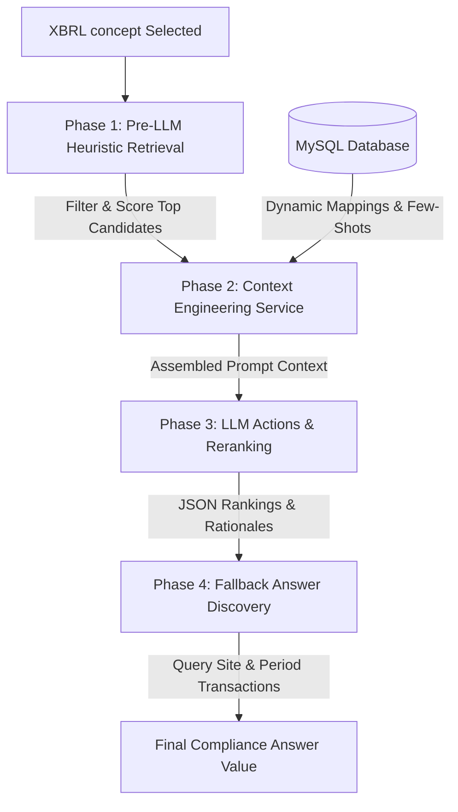

# SoFi TS Hybrid ESG Mapping Architecture

This document describes the design and lifecycle of the **Hybrid ESG Mapping Engine** implemented in the SoFi TS workspace. The system bridges abstract regulatory disclosures (such as XBRL taxonomy concepts) with operational database records (the hierarchical "Position Tree") using a multi-phase **Retriever-Reranker** architecture.

---

## 1. High-Level Architecture Overview

To balance latency, API cost, and semantic accuracy, the system avoids feeding the entire database of **2,537 active positions** to the Large Language Model (LLM). Instead, it implements a hybrid pipeline:

---

## 2. Phase 1: Pre-LLM Heuristic Retrieval (Pruning the Search Space)

When a taxonomy concept is selected, [mappingEngine.py](file:///Users/eugene/dev/ai-projects/smart-mapping/mappingEngine.py) acts as a fast retriever to narrow down candidate positions from 2,537 nodes to the top 5–20 candidates.

### Heuristics Breakdown:
1. **Concept Classification:** Analyzes the concept type (e.g., decimal, monetary, text block) and tags it as *Quantitative*, *Narrative*, or *Choice* to match physical limits.
2. **Tokenization:** Splitting namespaces, camelCase, snake_case, and PascalCase identifiers into lowercased tokens, eliminating stop-words (`esrs`, `of`, `and`, etc.).
3. **Multi-Factor Scoring (0.0 to 1.0):**
   * **Lexical Overlap (50%):** Calculates Jaccard similarity between concept and position tokens, adding a partial substring boost.
   * **Unit Compatibility (30%):** Verifies if the concept's inferred unit class (e.g. Mass, Energy, Volume) matches the candidate position's configured unit limits.
   * **Temporal Alignment (10%):** Aligns concept period styles (`duration` vs. `instant`) with position types (`Flow` vs. non-flow).
   * **Structural Proximity (10%):** Runs closure table queries against `position_path` to boost candidates whose ancestors are already mapped to parent concepts in the presentation hierarchy.

---

## 3. Phase 2: Context Engineering (Prompt Synthesis)

The [contextService.py](file:///Users/eugene/dev/ai-projects/smart-mapping/contextService.py) service dynamically compiles a structured Markdown prompt to present the LLM with the context required to apply human reasoning.

### Assembled Context Components:
*   **Human Selection Workflow:** Includes the 6 rules shared by the human operator:
    1. Clear naming verification.
    2. Keyword match search.
    3. Semantic alignment checks.
    4. Detailed description fallback.
    5. Candidate iteration.
    6. Naming adjustment flags.
*   **Assumed Tool Signatures:** Lists helper functions (such as `query_database`, `search_positions`, and `check_transaction_activity`) to define how an agent checks database states.
*   **Dynamic Few-Shot Examples:** Queries MySQL mapping tables (`position_taxonomy_concept` join table) to extract active, human-approved mappings to demonstrate real matching logic.
*   **Concept & Heuristic Match Metadata:** Attaches target concept details alongside the heuristically compiled candidates (complete with paths, descriptions, and breakdown scores).
*   **System Instructions & Output Schema:** Enforces formatting rules requesting output strictly conforming to a designated JSON schema.

---

## 4. Phase 3: LLM Actions (Reranking & Rationale)

The [llmService.py](file:///Users/eugene/dev/ai-projects/smart-mapping/llmService.py) module handles model interaction.

### Action Lifecycle:
1. **Model Invocation:** Submits the prompt context to the Azure OpenAI endpoint using the deployment (`md-gpt-5.4-mini`) under JSON mode.
2. **Semantic Evaluation:** The model re-scores the candidates by evaluating the descriptions, structural paths, and context against the human rules.
3. **Structured Response Generation:** Returns a structured JSON containing:
   * Re-ranked candidate indexes.
   * Detailed natural-language reasoning justifying the matching rationale (e.g., explaining unit matches or keyword alignments).
   * **`suggestedRename` tags:** Flags positions whose names are confusing or mismatch the reporting requirements (Step 6 of the human workflow).
4. **Graceful Connection Fallback:** If the connection is restricted (such as public access blocks returning a `403 Forbidden` response), the handler automatically catches the exception and dynamically compiles local simulated rerankings matching the target JSON schema to maintain UI stability.

---

## 5. Phase 4: Fallback Answer Discovery

Once the reranked candidate list is returned to the app harness:
*   The transaction discovery loop in `mappingEngine.py` sequentially checks the candidates.
*   If Candidate #1 has no logged data for the requested customer site and period context, it falls back to Candidate #2, #3, etc.
*   This ensures that the best operational value is extracted and surfaced to the compliance officer in real-time.
