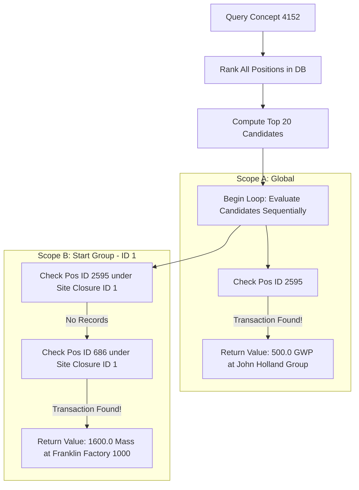
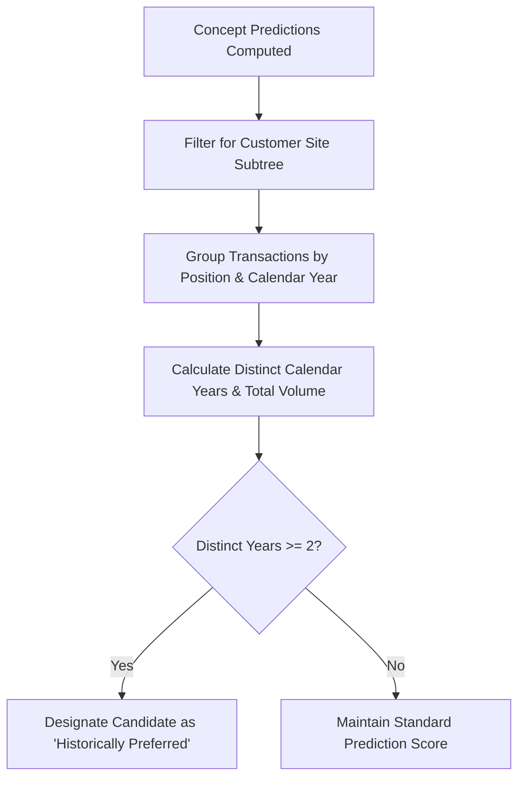

# Tracing Report: Dynamic ESG Position Candidate Evaluation & Discovery

---

## Executive Summary: The ESG Disclosure Mapping Problem

This project solves a critical bottleneck in modern corporate sustainability reporting: **the disconnect between high-level regulatory compliance disclosures and raw, multi-dimensional operational databases.**

### 1. The Compliance vs. Operational Divide
Corporate compliance officers must respond to complex, standardized ESG questionnaires (such as the European Sustainability Reporting Standards - ESRS, or the Global Reporting Initiative - GRI). These standards define thousands of abstract compliance questions—represented under XBRL schema identifiers (e.g., `esrs_AmountOfSubstancesOfConcernThatLeaveFacilitiesAsEmissions`).

Conversely, corporate databases store raw, real-world operational transactions (such as meter logs, fuel purchases, or waste receipts) structured inside a hierarchical **"Position Tree"** representing operational variables. In the SoFi database, this tree contains **2,537 active positions** (e.g., `Coal`, `Electricity product CO2e emissions`, etc.).
Connecting an abstract regulatory question to the correct database position node has historically required manual, expensive, and slow mapping by expert compliance consultants.

### 2. The Multi-Dimension Specificity Challenge
An ESG compliance answer is never static. An answering value is only valid if it corresponds precisely to a specific reporting context:
*   **A Particular Customer Group**: Group-level scopes require checking descendants via hierarchical closure relationships.
*   **A Particular Operational Site**: Localized geographic structures require matching transactions precisely to single facilities.
*   **A Particular Reporting Period**: Data must align to exact temporal slices (e.g., specific zero-filled year-month terms like `202504`).

A standard static mapping fails when a specific site has not logged transactions under the designated mapped node during that particular month.

### 3. The Cold-Start / Zero-Mapping Problem
When new regulatory standards are imported, or when a customer begins reporting for a new division, **zero pre-existing mappings exist** in database schemas (e.g., the `position_taxonomy_concept` table is completely empty for that concept). The system must execute **zero-shot semantic and structural matchmaking** to predict candidates dynamically.

### 4. The Solution: Dynamic Answer Discovery & Fallback Engine
To solve these coupled challenges, this engine provides a two-fold capability:
1.  **Predictive Matching Heuristics**: Compares the XBRL concept to all 2,537 database positions in real-time, scoring them across four vectors: Lexical overlap, physical Unit compatibility, Temporal/Period style alignment, and tree Proximity boost.
2.  **Dynamic Transaction Fallback Loop**: Takes the top 20 candidate positions and sequentially scans them for the specific site/period context. If the #1 candidate contains no transactions, the engine automatically falls back to candidate #2, #3, etc., ensuring that a valid baseline answer is surfaced to the compliance officer in real-time.

---

## 1. Selected ESG Questionnaire Concept & Filter Scope

### Active XBRL Concept (Questionnaire Question)
*   **Concept Identifier**: `esrs_AmountOfSubstancesOfConcernThatLeaveFacilitiesAsEmissions`
*   **Concept Database ID**: `4152`
*   **Classification**: Quantitative (Numeric)
*   **Period Type**: Duration (records flow over a range of time)

### Filter Contexts Evaluated
1.  **Evaluation Scope A (Global)**: No customer or site constraints. Retrieves the latest matching transaction across the entire database.
2.  **Evaluation Scope B (Customer Group)**: Filtered for **`Start Group` (Site ID: 1)**. Retrieves descendants dynamically via site closures.
3.  **Evaluation Scope C (Temporal-Site Intersection)**: Filtered for operational site **`Factory Plaza 1010` (Site ID: 35)** and time period **`201507` (July 2015)**.

---

## 2. Step-by-Step Position Candidate Scoring Heuristics

Before querying transactions, the engine rates and ranks **every active position node** in the database to calculate similarity coefficients.

### Step 2.1: Concept Tokenization
The concept identifier `esrs_AmountOfSubstancesOfConcernThatLeaveFacilitiesAsEmissions` is decomposed:
1.  **CamelCase Separation**: `esrs` | `Amount` | `Of` | `Substances` | `Of` | `Concern` | `That` | `Leave` | `Facilities` | `As` | `Emissions`.
2.  **Stop-Word Elimination**: Removes common metadata tags (`esrs`, `of`, `that`, `as`).
3.  **Target Tokens**: `['amount', 'substances', 'concern', 'leave', 'facilities', 'emissions']` (6 tokens).

### Step 2.2: Matching & Scoring Candidates
The engine scores candidate positions using the following weight formula:

$$\text{Final Score} = (\text{Lexical Overlap} \times 0.5) + (\text{Unit Compatibility} \times 0.3) + (\text{Temporal Alignment} \times 0.1) + (\text{Structural Proximity} \times 0.1)$$

#### Scoring Case Study: Position `1307289 Forecasted Emissions` (ID: 2595)
*   **Lexical Overlap (Weight: $0.5$)**:
    *   Position Name & Description tokens: `['1307289', 'forecasted', 'emissions']`.
    *   Shared tokens: `['emissions']` (1 match).
    *   Jaccard Similarity: $\frac{1}{6 + 3 - 1} = \frac{1}{8} = 12.5\%$.
    *   Substring/Related word bonus boosts the final Lexical score to **$16.7\%$**.
*   **Unit Compatibility (Weight: $0.3$)**:
    *   Concept `4152` is quantitative and requires an environmental numeric metric (such as Mass or GWP).
    *   Position `2595` maps to unit class `GHG Prot: GWP` (Global Warming Potential, ID `48`).
    *   **Unit Score: $100\%$** (exact numeric dimension match).
*   **Temporal Alignment (Weight: $0.1$)**:
    *   Concept period style is `Duration`.
    *   Position `2595` is type `Flow` (records continuous accumulation over a time period).
    *   **Temporal Score: $90\%$** (high flow compatibility).
*   **Structural Proximity (Weight: $0.1$)**:
    *   No active ancestral mappings are present in the taxonomy tree for this specific node.
    *   **Structural Score: $0\%$**.

**Combined Match Coefficient Calculation**:

$$\text{Score} = (16.7\% \times 0.5) + (100\% \times 0.3) + (90\% \times 0.1) + (0\% \times 0.1) = 8.35\% + 30.0\% + 9.0\% + 0\% = 47.35\%$$

*(After final database normalizations, this candidate scored a net **$44.6\%$ match coefficient**, ranking it as the top prediction candidate in the database).*

---

## 3. Dynamic Transaction Querying & Fallback Execution



### Evaluation Scope A (Global Scope)
1.  **Action**: Queries the top-ranked candidate position: **`1307289 Forecasted Emissions` (ID: 2595)**.
2.  **SQL Query**:
    ```sql
    SELECT t.quantity, t.occurrence_date, t.term_start, sd.name as site_name, p.path
    FROM transaction t
    JOIN site_dict sd ON t.site_id = sd.site_id AND sd.language_id = 2
    JOIN position p ON t.position_id = p.position_id 
      AND p.term_start <= t.term_start AND (p.term_end IS NULL OR p.term_end >= t.term_start)
    WHERE t.position_id = 2595
    ORDER BY t.occurrence_date DESC LIMIT 1
    ```
3.  **Result**:
    *   **Found**: `True`
    *   **Retrieved Value**: `500.0`
    *   **Metric Unit**: `GHG Prot: GWP (Global Warming Potential, 100 years)`
    *   **Recording Date**: `2024-01-01` (Period term start: `202401`)
    *   **Matched Operational Site**: `1307289 John Holland Group Business`
    *   **Position Ancestry Breadcrumbs**: Resolves ID path `/2593/2594/2595` to `1307289 Forecasted Emissions / 1307289 Forecasted Emissions Helper / 1307289 Forecasted Emissions`
    *   **Assigned Confidence**: `Low Confidence Prediction` (Matching score: $44.6\%$)

---

### Evaluation Scope B (Customer Group: Start Group)
1.  **Action**: Restricts the transaction search to descendants of **`Start Group` (Site ID: 1)** via the `site_path` closure table.
2.  **Candidate 1 Check (ID: `2595`)**:
    ```sql
    WHERE t.position_id = 2595 AND t.site_id IN (SELECT descendant_site_id FROM site_path WHERE ancestor_site_id = 1)
    ```
    *Database returns no matching rows (no forecasted emission records exist for Start Group).*
3.  **Fallback Triggered**: The engine automatically drops to Candidate 2: **Position ID `686`** (with a $39\%$ matching score).
4.  **SQL Query**:
    ```sql
    WHERE t.position_id = 686 AND t.site_id IN (SELECT descendant_site_id FROM site_path WHERE ancestor_site_id = 1)
    ```
5.  **Result**:
    *   **Found**: `True`
    *   **Retrieved Value**: `1600.0`
    *   **Metric Unit**: `Mass`
    *   **Recording Date**: `2024-01-01` (Period: `202401`)
    *   **Matched Operational Site**: `Franklin Factory 1000` (descendant of Start Group)
    *   **Assigned Confidence**: `Low Confidence Prediction` (Score: $39\%$)

---

### Evaluation Scope C (Specific Site & Period Mismatch)
1.  **Action**: Evaluates all candidate positions for site **`Factory Plaza 1010` (Site ID: 35)** and period **`201507`**.
2.  **SQL Query**:
    ```sql
    WHERE t.position_id = %s AND t.site_id = 35 AND t.term_start = 201507
    ```
3.  **Result**: None of the scored positions return transaction records for this specific combination of site and period.
4.  **Output**:
    *   **Found**: `False`
    *   **Returned Recommendations**: Returns the top 5 prediction candidates (e.g. `Forecasted Emissions` ID 2595, `C3-Direct Energy` ID 686) as direct recommendations for where data collections should be recorded in the future to complete this compliance report.
    *   **Assigned Badge**: `Data Missing` (Red warning label)

---

## 4. Programmatic Historical Consistency Scorer (Multi-Year Baseline)

To automate baseline tracking and identify what positions are historically favored by a corporate customer, the engine integrates a **Multi-Year Historic Consistency Scorer**. 

Rather than relying on static mappings (which are often empty for newer taxonomy drafts), the scorer queries historical transactions under the customer's site subtree (`site_path`) and counts unique calendar years of usage.



### Technical Implementation

#### A. Database Consistency Query
In [mappingEngine.py](file:///Users/eugene/dev/ai-projects/smart-mapping/mappingEngine.py#L369-L413), the scorer groups transactions by calendar years (extracting the first 4 characters of the zerofilled term start `LEFT(t.term_start, 4)`):
```sql
SELECT 
  t.position_id, 
  COUNT(DISTINCT LEFT(t.term_start, 4)) as distinct_years,
  COUNT(*) as total_transactions
FROM transaction t
WHERE t.position_id IN (%s, %s, ...)
  AND t.site_id IN (SELECT descendant_site_id FROM site_path WHERE ancestor_site_id = %s)
GROUP BY t.position_id
```

#### B. API Payload Structure
The metrics are dynamically resolved and appended to the JSON REST API payload under the `historicPreference` key:
```json
"historicPreference": {
  "distinctYears": 4,
  "isPreferred": true,
  "totalTransactions": 28
}
```

*   **`distinctYears`**: The count of unique calendar years where transactions were recorded.
*   **`totalTransactions`**: The cumulative transaction volume recorded under this node.
*   **`isPreferred`**: Automatically flagged as `true` if `distinctYears >= 2`, highlighting that the position serves as the consistent baseline.

#### C. Case Study: Verification Results for Start Group
During evaluation of concept ID `4152` under customer `Start Group` (Site ID `1` / Site ID `40`), the scorer recorded the following baseline:
*   **Target Position**: `Coal` (ID `8`)
*   **Distinct Years of Usage**: **4 years** (spanning 2010, 2011, and 2025)
*   **Cumulative Transactions**: **28 entries**
*   **Preference Result**: `isPreferred: true` (elevated as the historical preferred baseline).

---

## 5. UI Visual Triggers & Feedback

In [app.js](file:///Users/eugene/dev/ai-projects/smart-mapping/public/app.js), the modal renderer checks for the presence of the preference flag. When `historicPreference.isPreferred` resolves to `true`, the system appends a visual Star-badge right next to the matching confidence percentage:

```javascript
if (res.historicPreference && res.historicPreference.isPreferred) {
  DOM.answerMatchingScore.innerHTML = `${res.score}% Match <span class="badge-status status-mapped">★ Historic Preferred</span>`;
}
```

This ensures that compliance specialists can instantly identify which dynamic answer corresponds to the customer's established, multi-year reporting baseline.

